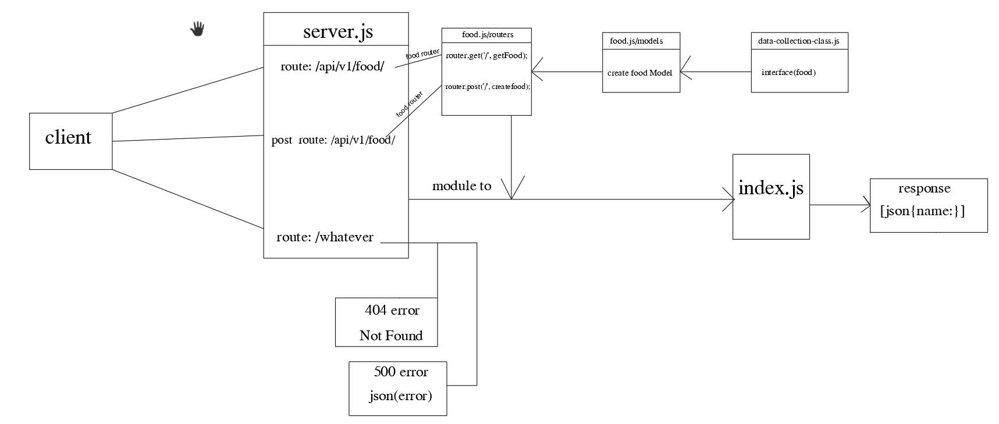

# api-server

- ## Author: Abdalrhman Albdahat

- #### lab4
- working branch : [dev](https://github.com/boodah96/basic-api-server/tree/dev)
links:
- [Heroku](https://boodah96-api-server.herokuapp.com/api/v1/food/)
[GitHub-repo](https://github.com/boodah96/api-server)
[PR](https://github.com/boodah96/api-server/pull/1#partial-pull-merging)
Start work with this commands:
- `npm init -y`
- `npm i express dotenv cors morgan mongoose eslint`

to test follow these command:
- `npm i jest supertest @code-fellows/supergoose`
- npm test
main rotes:
- `/api/v1/clothes/`
- `/api/v1/food/`
- heroku test: https://boodah96-api-server.herokuapp.com/api/v1/food/

UML diagram:
